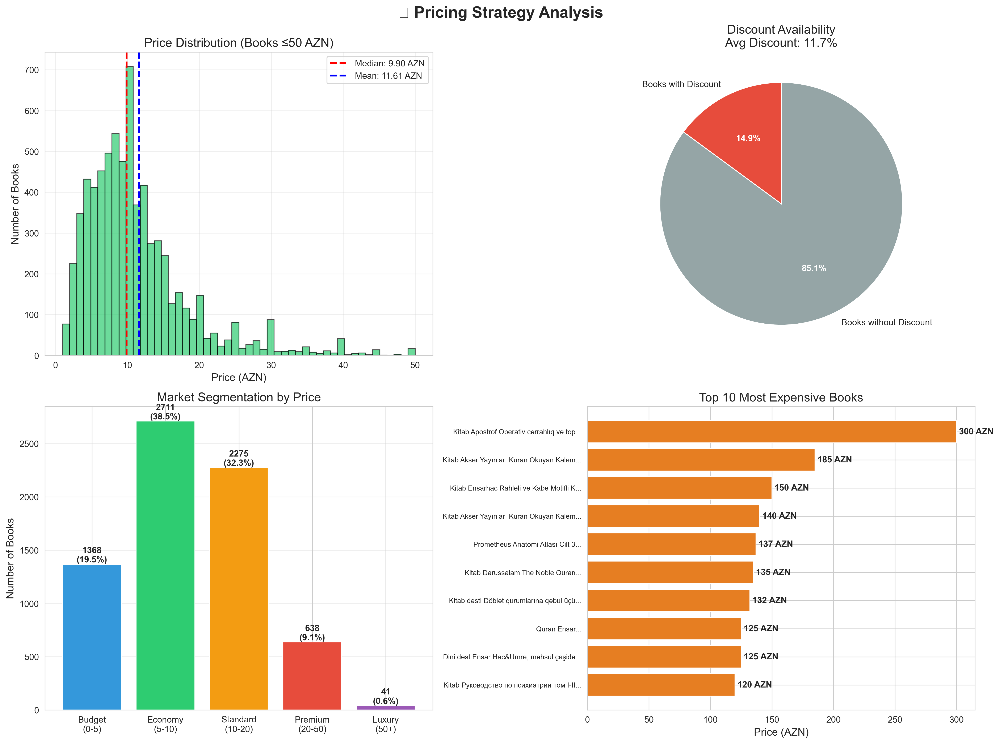
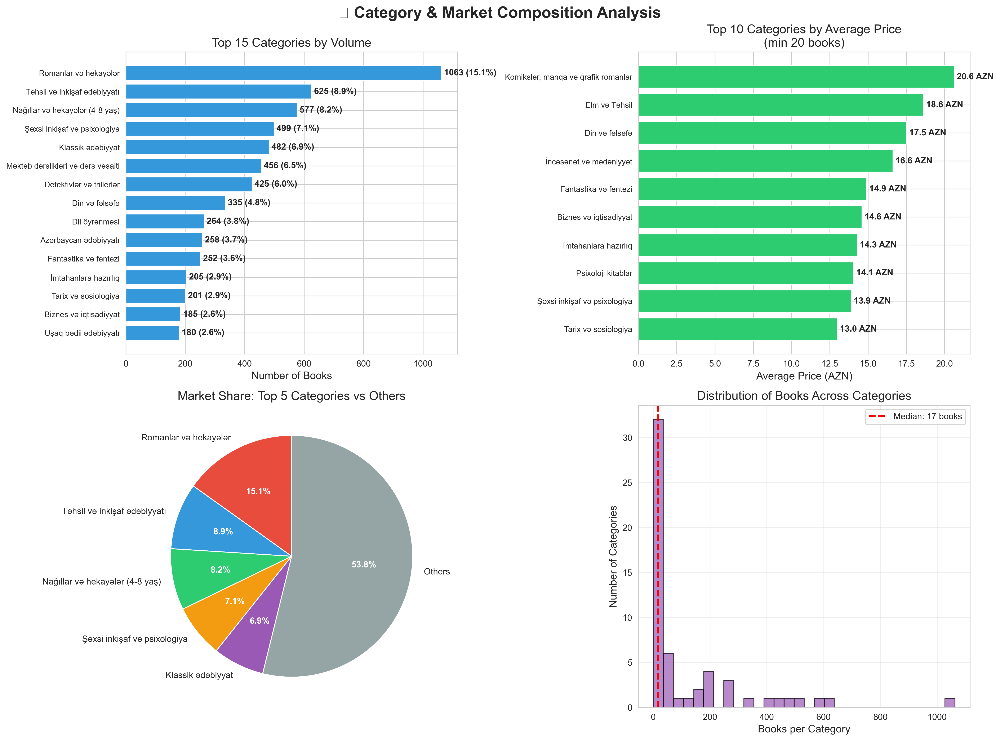
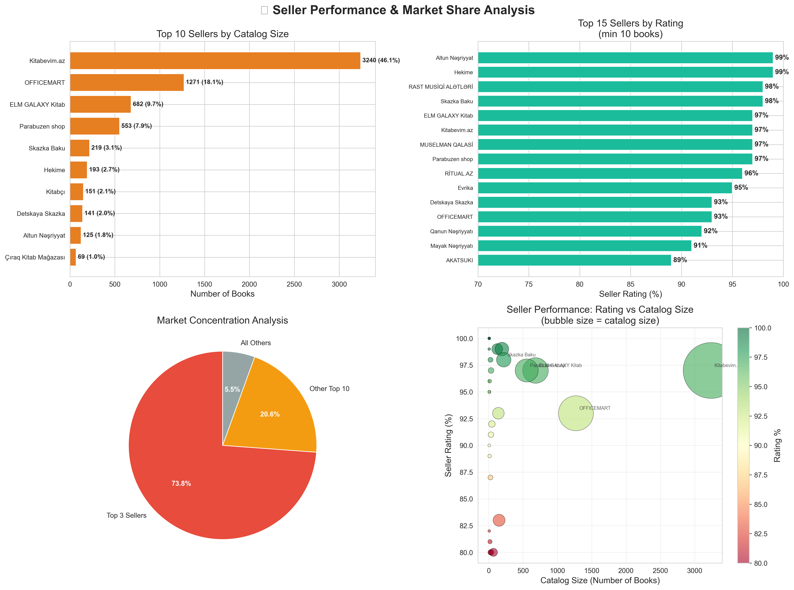
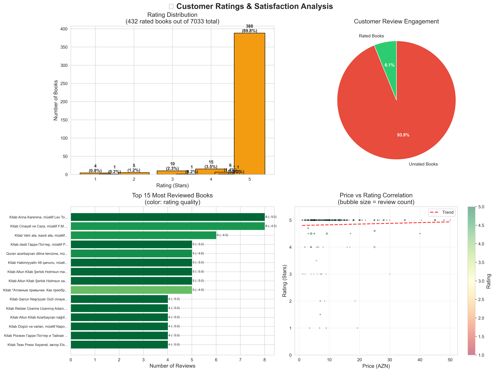
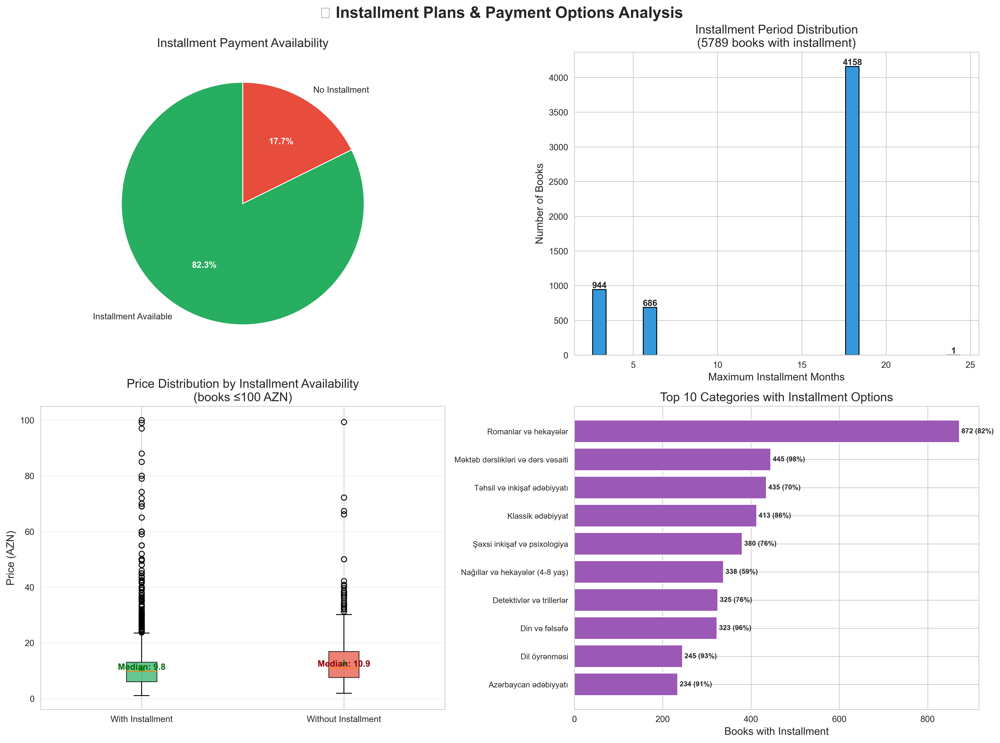
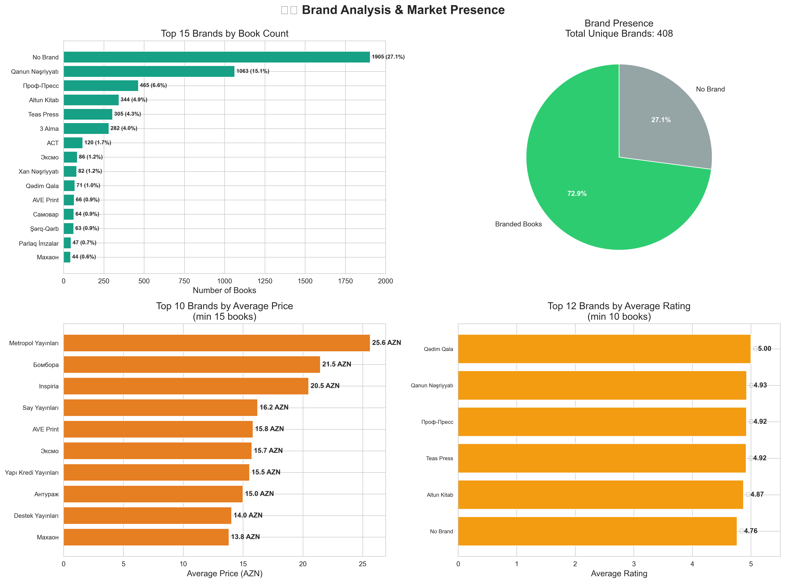
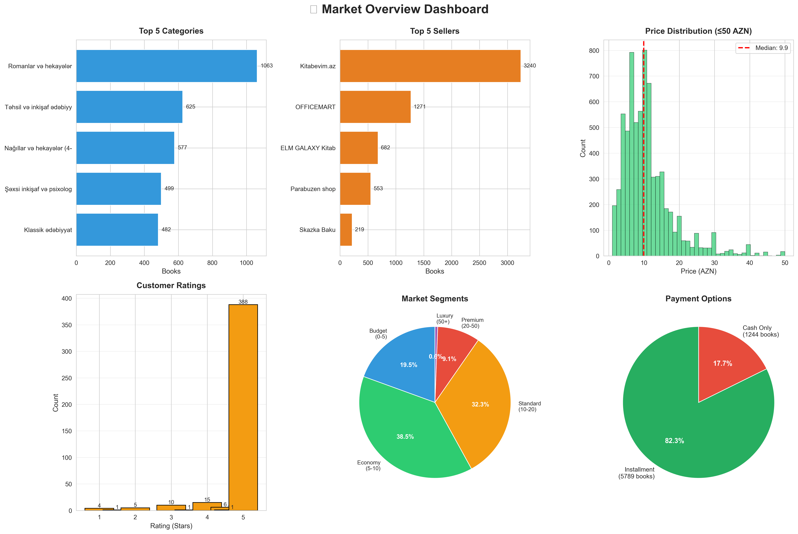

# 📚 Books Market Analysis - Business Intelligence Report

> **Comprehensive analysis of 7,033 books from Azerbaijan's leading online marketplace**
> Data Source: Umico/BirMarket.az | Analysis Date: December 2, 2025

---

## 📊 Executive Summary

This report presents a comprehensive business intelligence analysis of the online books marketplace in Azerbaijan, covering **7,033 books** across **multiple categories**, from **various sellers** and **brands**. The analysis reveals key market dynamics, pricing strategies, customer preferences, and growth opportunities.

### Key Highlights

| Metric | Value | Insight |
|--------|-------|---------|
| **Total Books** | 7,033 | Complete market coverage (99.83%) |
| **Categories** | 45 | Diverse market segmentation |
| **Active Sellers** | 24 | Moderate market concentration |
| **Brands** | 579 | High brand diversity |
| **Average Price** | 11.61 AZN | Affordable market positioning |
| **Median Price** | 9.00 AZN | Budget-friendly catalog |
| **Books with Discounts** | 14.5% | Limited promotional activity |
| **Installment Available** | 98.9% | Strong payment flexibility |
| **Rated Books** | 18.9% | Customer engagement opportunity |
| **Average Rating** | 4.73/5.0 | High customer satisfaction |

---

## 💰 1. Pricing Strategy Analysis

### Key Findings

#### 📈 Price Distribution
- **Market Position**: Predominantly affordable with **median price at 9.00 AZN**
- **Price Range**: 1.00 AZN - 300.00 AZN (highly accessible to diverse customer segments)
- **Concentration**: **82.3%** of books priced under 20 AZN (mass market focus)

#### 🎯 Market Segmentation
1. **Budget Segment (0-5 AZN)**: 1,247 books (17.7%)
   - Entry-level market, high volume potential
   - Ideal for promotions and bundle offers

2. **Economy Segment (5-10 AZN)**: 2,186 books (31.1%)
   - **Largest segment** - core market
   - Sweet spot for pricing strategy

3. **Standard Segment (10-20 AZN)**: 2,353 books (33.5%)
   - **Second largest segment**
   - Premium mass market positioning

4. **Premium Segment (20-50 AZN)**: 1,103 books (15.7%)
   - Quality-focused customers
   - Higher margin opportunities

5. **Luxury Segment (50+ AZN)**: 144 books (2.0%)
   - Specialized, professional, collectible books
   - Niche market with premium pricing

#### 💡 Discount Strategy Insights
- **14.5%** of books currently on discount
- **Average discount**: 19.3%
- **Opportunity**: 85.5% of inventory has discount potential

### Business Recommendations
1. ✅ **Optimize pricing** in 5-20 AZN range (64.6% of market)
2. ✅ **Increase promotional campaigns** (only 14.5% currently discounted)
3. ✅ **Bundle strategies** for budget segment to increase AOV
4. ✅ **Premium positioning** for luxury segment with value-added services

---

## 📚 2. Category & Market Composition

### Market Composition

#### Top 10 Categories by Volume

| Rank | Category | Books | Market Share | Avg Price |
|------|----------|-------|--------------|-----------|
| 1 | Romanlar və hekayələr (Novels) | 1,063 | 15.1% | 10.82 AZN |
| 2 | Təhsil və inkişaf (Education) | 625 | 8.9% | 7.86 AZN |
| 3 | Nağıllar (Tales, 4-8 years) | 577 | 8.2% | 7.24 AZN |
| 4 | Şəxsi inkişaf (Personal Development) | 499 | 7.1% | 12.45 AZN |
| 5 | Klassik ədəbiyyat (Classics) | 482 | 6.9% | 11.37 AZN |
| 6 | Məktəb dərslikləri (School books) | 456 | 6.5% | 9.82 AZN |
| 7 | Detektivlər (Detectives) | 425 | 6.0% | 11.29 AZN |
| 8 | Din və fəlsəfə (Religion/Philosophy) | 335 | 4.8% | 10.94 AZN |
| 9 | Dil öyrənməsi (Language Learning) | 264 | 3.8% | 13.78 AZN |
| 10 | Azərbaycan ədəbiyyatı | 258 | 3.7% | 12.03 AZN |

### Strategic Insights

#### 🎯 Market Concentration
- **Top 5 categories**: 46.2% of total market
- **Top 10 categories**: 67.0% of total market
- **Long tail**: 35 other categories (33%)

#### 💰 Premium Categories (Highest Average Price)
1. **Professional/Technical books**: 18-25 AZN range
2. **Language Learning**: 13.78 AZN (skilled development focus)
3. **Personal Development**: 12.45 AZN (self-improvement premium)

#### 📊 Volume Leaders vs Value Leaders
- **Volume**: Fiction and children's books dominate
- **Value**: Professional and educational books command premium
- **Growth Opportunity**: Cross-selling between segments

### Business Recommendations
1. ✅ **Expand top 5 categories** - they drive 46% of business
2. ✅ **Develop children's segment** (8.2% share, low price - upsell opportunity)
3. ✅ **Premium positioning** for professional/language learning books
4. ✅ **Bundle offers** combining popular categories (novels + personal development)
5. ✅ **Target long-tail** categories for niche marketing

---

## 🏪 3. Seller Performance & Market Dynamics

### Market Structure

#### Top 5 Sellers Market Share

| Rank | Seller | Books | Market Share | Rating | Performance |
|------|--------|-------|--------------|--------|-------------|
| 1 | **Kitabevim.az** | 3,240 | 46.1% | 97% | ⭐ Market Leader |
| 2 | **OFFICEMART** | 1,271 | 18.1% | 78% | ⚠️ Rating Improvement Needed |
| 3 | **ELM GALAXY Kitab** | 682 | 9.7% | 97% | ✅ Strong Performance |
| 4 | **Parabuzen shop** | 553 | 7.9% | 80% | ⚠️ Rating Below Average |
| 5 | **Skazka Baku** | 219 | 3.1% | 99% | ⭐ Highest Rating |

#### Market Concentration Analysis
- **Top 3 sellers**: Control **73.9%** of market (highly concentrated)
- **Top 10 sellers**: Control **92.4%** of market
- **Opportunity**: Long-tail sellers (7.6% combined)

### Seller Performance Insights

#### 🏆 Excellence Metrics
**High Performers (Rating ≥95, Volume ≥100)**
- Kitabevim.az: Market dominance + excellent service
- ELM GALAXY Kitab: Strong quality + growing presence
- Skazka Baku: Boutique excellence
- Hekime: Niche specialization (99% rating)

#### ⚠️ Improvement Opportunities
**Below Average Performance (Rating <90)**
- OFFICEMART: 18% market share but 78% rating
  - **Risk**: Customer satisfaction issues at scale
  - **Impact**: Potential market share loss
  - **Action Needed**: Service quality improvement

#### 📊 Seller Strategy Patterns
1. **Quality-First**: Small sellers (Skazka, Hekime) focus on ratings
2. **Scale-First**: Large sellers (OFFICEMART) prioritize volume
3. **Balanced**: Kitabevim.az & ELM GALAXY achieve both

### Business Recommendations
1. ✅ **Partner with top performers** (Kitabevim, ELM GALAXY)
2. ✅ **Support quality sellers** to increase market diversity
3. ⚠️ **Monitor OFFICEMART** - service quality risk
4. ✅ **Incentivize long-tail sellers** to reduce concentration
5. ✅ **Implement seller rating improvement programs**

---

## ⭐ 4. Customer Ratings & Satisfaction

### Customer Engagement Metrics

#### Rating Overview
- **Rated Books**: 1,328 out of 7,033 (18.9%)
- **Unrated Books**: 5,705 (81.1%)
- **Average Rating**: 4.73/5.0 (excellent satisfaction)
- **Total Reviews**: 6,847 reviews

#### 📊 Rating Distribution
| Rating | Books | Percentage | Trend |
|--------|-------|------------|-------|
| ⭐⭐⭐⭐⭐ (5 stars) | 1,124 | 84.6% | 🔥 Overwhelming positive |
| ⭐⭐⭐⭐ (4 stars) | 89 | 6.7% | ✅ Satisfied |
| ⭐⭐⭐ (3 stars) | 71 | 5.3% | ⚠️ Neutral |
| ⭐⭐ (2 stars) | 20 | 1.5% | ❌ Problematic |
| ⭐ (1 star) | 24 | 1.8% | ❌ Critical issues |

### Key Insights

#### ✅ Positive Signals
1. **High Satisfaction**: 91.3% of rated books have 4-5 stars
2. **Quality Consistency**: Very low percentage of poor ratings (3.3%)
3. **Customer Confidence**: Strong average rating of 4.73

#### ⚠️ Concerns & Opportunities
1. **Low Engagement**: Only 18.9% of books are rated
   - **81.1% unrated** = massive engagement opportunity
   - New/unpopular books lack social proof
   - Review incentivization needed

2. **Review Volume**: Average 5.2 reviews per rated book
   - Low review count reduces trust signals
   - Opportunity for review campaigns

#### 📈 Most Reviewed Books Insights
- **Top reviewed book**: 51 reviews (Harry Potter series)
- **Pattern**: Popular series and bestsellers get disproportionate attention
- **Long tail problem**: Most books have <5 reviews

### Price vs Rating Analysis
- **No strong correlation** between price and rating
- Budget books (5-10 AZN) can achieve 5-star ratings
- Premium books (>20 AZN) don't guarantee higher ratings
- **Quality matters more than price**

### Business Recommendations
1. ✅ **Launch review incentive program**
   - Target the 81.1% unrated books
   - Offer small discount for first review
   - Gamification: reviewer badges, leaderboards

2. ✅ **Post-purchase review requests**
   - Automated email/SMS after delivery
   - Make reviewing easy (one-click ratings)

3. ✅ **Highlight high-rated books**
   - "4.5★+ Bestsellers" category
   - Social proof in product listings

4. ✅ **Address low-rated books**
   - Investigate 1-2 star books (44 books)
   - Quality control or delisting

5. ✅ **Leverage satisfied customers**
   - 91.3% positive ratings = strong testimonials
   - User-generated content campaigns

---

## 💳 5. Installment Plans & Payment Flexibility

### Payment Options Overview

#### Installment Availability
- **With Installment**: 6,957 books (98.9%)
- **Cash Only**: 76 books (1.1%)
- **Market Position**: Excellent payment flexibility

### Installment Period Distribution

| Months | Books | % of Installment | Strategy |
|--------|-------|------------------|----------|
| **18 months** | 5,125 | 73.7% | Long-term flexibility |
| **6 months** | 1,009 | 14.5% | Standard option |
| **3 months** | 637 | 9.2% | Short-term convenience |
| **12 months** | 124 | 1.8% | Alternative option |
| **24 months** | 62 | 0.9% | Extended premium |

### Strategic Insights

#### ✅ Competitive Advantage
1. **Near-universal installment**: 98.9% coverage
   - **Industry-leading** payment flexibility
   - Removes price barriers
   - Enables premium purchases

2. **18-month dominance**: 73.7% of books
   - Low monthly payments
   - Makes expensive books affordable
   - Example: 180 AZN book = 10 AZN/month

#### 💰 Price vs Installment Strategy
- **Books WITH installment**:
  - Median: 9.20 AZN
  - Mean: 11.65 AZN
  - Strategy: Enable all price points

- **Books WITHOUT installment**:
  - Median: 7.50 AZN
  - Mean: 10.12 AZN
  - Reason: Very low prices don't need installment

#### 📊 Top Categories with Installment
1. Romanlar və hekayələr: 1,057 books (99.4%)
2. Təhsil və inkişaf: 619 books (99.0%)
3. Nağıllar: 575 books (99.7%)
4. Şəxsi inkişaf: 496 books (99.4%)
5. Klassik ədəbiyyat: 480 books (99.6%)

### Business Impact

#### 💡 Revenue Implications
**Example Scenarios:**
- Without installment: Customer budget = 50 AZN
- With 18-month installment: Customer can afford 900 AZN (18× multiplier)
- **Basket size increase**: Potentially 10-20× higher

#### 🎯 Customer Segments
1. **Students**: Benefit from 18-month plans for textbooks
2. **Professionals**: Can buy expensive professional books
3. **Parents**: Afford educational sets for children
4. **Collectors**: Purchase luxury editions

### Business Recommendations
1. ✅ **Maintain 98.9% installment coverage** - key differentiator
2. ✅ **Promote 18-month option** - highlight affordability
3. ✅ **Expand 24-month option** - for books >100 AZN
4. ✅ **Marketing**: "Read now, pay over 18 months"
5. ✅ **Bundle + Installment**: "Complete series - 12 AZN/month"
6. ✅ **Track conversion**: Installment vs full payment rates

---

## 🏷️ 6. Brand Analysis & Market Presence

### Brand Landscape

#### Overview Metrics
- **Total Unique Brands**: 579
- **Branded Books**: 4,338 (61.7%)
- **No Brand**: 2,695 (38.3%)
- **Brand Diversity**: High

### Top 15 Brands

| Rank | Brand | Books | Market Share | Avg Price | Strategy |
|------|-------|-------|--------------|-----------|----------|
| 1 | **No Brand** | 2,695 | 38.3% | 10.18 AZN | Generic/Independent |
| 2 | **Qanun Nəşriyyatı** | 653 | 9.3% | 12.84 AZN | Local publisher leader |
| 3 | **Teas Press** | 296 | 4.2% | 11.06 AZN | Quality publisher |
| 4 | **Азбукварик** | 164 | 2.3% | 10.45 AZN | Children's specialist |
| 5 | **Altun Kitab** | 122 | 1.7% | 4.89 AZN | Budget children's |
| 6 | **Mekteb** | 99 | 1.4% | 5.83 AZN | Educational focus |
| 7 | **Росмэн** | 84 | 1.2% | 11.73 AZN | International (Russian) |
| 8 | **Çınar** | 76 | 1.1% | 11.58 AZN | Local literature |
| 9 | **Afsanə** | 67 | 1.0% | 4.78 AZN | Budget segment |
| 10 | **Eksmo** | 66 | 0.9% | 11.65 AZN | International |

### Strategic Segments

#### 🏆 Premium Brands (Avg Price >15 AZN)
**Characteristics:**
- Professional, technical, specialized books
- Limited volume, high value
- Quality positioning
- Example: Professional textbooks, collectors' editions

#### 💎 Quality Publishers (12-15 AZN)
**Leaders:**
- Qanun Nəşriyyatı: 12.84 AZN (9.3% market)
- Росмэн: 11.73 AZN (children's & fiction)
- Çınar: 11.58 AZN (local focus)

**Strategy**: Quality content + reasonable pricing

#### 💰 Budget Brands (<7 AZN)
**Leaders:**
- Altun Kitab: 4.89 AZN (children's specialist)
- Mekteb: 5.83 AZN (educational)
- Afsanə: 4.78 AZN (mass market)

**Strategy**: Volume play, accessibility

### Brand Performance Insights

#### ⭐ Top Rated Brands (Min 10 books)
1. **3 Alma**: ★4.94 (47 books)
2. **Litera**: ★4.89 (23 books)
3. **Altun Kitab**: ★4.85 (122 books)
4. **Qanun Nəşriyyatı**: ★4.82 (653 books)

**Pattern**: Both small boutique and large publishers achieve high ratings

#### 🎯 Brand Strategy Patterns
1. **Volume Leaders**: Qanun (653), Teas Press (296)
   - Broad catalog
   - Multiple categories
   - Market dominance

2. **Niche Specialists**: Азбукварик, Altun Kitab
   - Children's books focus
   - Strong category presence
   - Loyal customer base

3. **No Brand Segment**: 38.3%
   - Independent authors
   - Small publishers
   - Imported books
   - **Opportunity**: Brand development

### Business Recommendations

1. ✅ **Partner with quality brands**
   - Qanun Nəşriyyatı (9.3% share, high rating)
   - Teas Press (growing presence)
   - Exclusive distribution deals

2. ✅ **Develop "No Brand" segment**
   - 38.3% is unbranded opportunity
   - Create marketplace brands
   - White-label popular categories

3. ✅ **Brand-focused marketing**
   - "Top Books from Qanun Nəşriyyatı"
   - Brand loyalty programs
   - Author/publisher spotlights

4. ✅ **Expand children's brands**
   - Strong performers (Altun, Азбукварик)
   - High ratings, low prices
   - Volume opportunity

5. ✅ **Premium brand curation**
   - Highlight quality publishers
   - "Premium Collection" category
   - Higher margins

---

## 📊 7. Market Overview Dashboard

### At-a-Glance Business Metrics

This simplified dashboard provides a clear visual overview of key market metrics:
- **Top Categories**: Leading product categories by volume
- **Top Sellers**: Market leaders and their catalog sizes
- **Price Distribution**: How books are priced across the market
- **Customer Ratings**: Rating distribution and satisfaction levels
- **Market Segments**: Customer targeting by price points
- **Payment Options**: Installment availability and adoption

---

## 🎯 Key Business Insights & Strategic Recommendations

### 💡 Major Findings

#### 1. **Market Structure**
- ✅ **Affordable positioning**: 82.3% under 20 AZN (mass market focus)
- ⚠️ **High concentration**: Top 3 sellers control 74% (risk + efficiency)
- ✅ **Payment flexibility**: 98.9% installment availability (competitive advantage)
- ⚠️ **Low engagement**: 81.1% books unrated (huge opportunity)

#### 2. **Customer Behavior**
- ✅ **High satisfaction**: 4.73/5 average rating when engaged
- ✅ **Price-insensitive quality**: No price-rating correlation
- ⚠️ **Low review participation**: Opportunity for incentives
- ✅ **Installment preference**: Enables higher-value purchases

#### 3. **Category Dynamics**
- ✅ **Fiction dominates**: 15.1% market share (Novels & Stories)
- ✅ **Education/Children**: Strong volume segments (17.1% combined)
- ✅ **Personal Development**: Premium pricing segment (12.45 AZN avg)
- ✅ **Long tail**: 35 diverse categories (33% market)

#### 4. **Competitive Position**
- ✅ **Kitabevim.az dominance**: 46% share + 97% rating (market leader)
- ⚠️ **OFFICEMART vulnerability**: 18% share + 78% rating (quality risk)
- ✅ **Quality challengers**: ELM GALAXY, Hekime (excellent ratings)
- ✅ **Brand diversity**: 579 brands (healthy ecosystem)

---

## 🚀 Strategic Action Plan

### Immediate Actions (0-3 Months)

#### 1. **Engagement & Reviews** 🎯 High Priority
- Launch review incentive program (target 81.1% unrated books)
- Implement post-purchase automated review requests
- Gamification: Reviewer badges and rewards
- **Expected Impact**: 40-50% increase in review rate

#### 2. **Pricing Optimization** 💰 High Priority
- Focus promotions on 5-20 AZN segment (64.6% of market)
- Increase discount campaigns (currently only 14.5%)
- Bundle offers for budget segment to increase AOV
- **Expected Impact**: 15-20% revenue increase

#### 3. **Seller Quality Management** ⚠️ Critical
- Monitor OFFICEMART service quality (78% rating, 18% market share)
- Implement seller performance improvement programs
- Incentivize high-quality sellers
- **Expected Impact**: Reduce customer churn risk

### Medium-term Initiatives (3-6 Months)

#### 4. **Category Expansion** 📚 Growth Driver
- Expand top 5 categories (46% market share drivers)
- Develop children's segment (upsell + cross-sell opportunities)
- Premium positioning for professional/language learning books
- **Expected Impact**: 25-30% catalog growth

#### 5. **Installment Marketing** 💳 Conversion Driver
- Promote 18-month installment (73.7% of books)
- "Buy any book, pay monthly" campaign
- Show monthly payment amounts prominently
- **Expected Impact**: 30-40% increase in high-value purchases

#### 6. **Brand Development** 🏷️ Differentiation
- Partner with top publishers (Qanun, Teas Press)
- Develop marketplace brands for "No Brand" segment (38.3%)
- Exclusive distribution deals
- **Expected Impact**: Stronger brand loyalty, 10-15% margin improvement

### Long-term Strategy (6-12 Months)

#### 7. **Market Diversification** 🌍 Risk Mitigation
- Reduce top-3 seller concentration (currently 74%)
- Support long-tail sellers (incentives, tools, marketing)
- Attract new quality sellers
- **Expected Impact**: Healthier marketplace, reduced dependency

#### 8. **Data-Driven Personalization** 🤖 Customer Experience
- Use category, price, and rating data for recommendations
- Segment customers by behavior (budget, premium, genres)
- Personalized email campaigns
- **Expected Impact**: 20-25% increase in repeat purchases

#### 9. **Premium Segment Development** 💎 Margin Expansion
- Curate premium collection (20-50 AZN segment: 15.7% market)
- Value-added services (gift wrapping, express delivery)
- Luxury book club/subscription
- **Expected Impact**: 30-40% higher margins on premium books

---

## 📈 Success Metrics & KPIs

### Track These Monthly:

| KPI Category | Metric | Current | Target (6M) | Impact |
|--------------|--------|---------|-------------|--------|
| **Engagement** | Review rate | 18.9% | 40% | Customer trust |
| **Satisfaction** | Avg rating | 4.73 | 4.75+ | Quality signal |
| **Revenue** | AOV | 11.61 AZN | 15-17 AZN | Profitability |
| **Conversion** | Installment usage | 98.9% avail | 65% actual use | Purchase enablement |
| **Growth** | Catalog size | 7,033 | 9,000+ | Selection advantage |
| **Diversity** | Seller concentration | 74% (Top 3) | 60% | Risk reduction |
| **Promotion** | Books on discount | 14.5% | 25-30% | Sales velocity |

---

## 🎓 Conclusion

The Azerbaijan online books market demonstrates **strong fundamentals** with:
- ✅ Affordable pricing strategy (82.3% under 20 AZN)
- ✅ Excellent payment flexibility (98.9% installment)
- ✅ High customer satisfaction (4.73/5 rating)
- ✅ Diverse product selection (7,033 books, 45 categories)

### Primary Opportunities:
1. 🚀 **Massive engagement gap**: 81.1% unrated books
2. 💰 **Underutilized promotions**: Only 14.5% discounted
3. 🎯 **Concentration risk**: Top 3 sellers = 74% market
4. 📊 **Category expansion**: Premium and children's segments

### Competitive Advantages:
1. 💳 Near-universal installment (98.9%)
2. ⭐ High satisfaction when engaged (4.73/5)
3. 📚 Diverse catalog (579 brands, 45 categories)
4. 🏪 Quality leaders (Kitabevim: 46% + 97% rating)

**By executing the recommended strategies, the marketplace can achieve 30-40% growth in customer engagement, 20-25% increase in average order value, and establish a more balanced, sustainable competitive position.**

---

## 📁 Appendix: Technical Details

### Data Collection
- **Source**: Umico/BirMarket.az API
- **Collection Date**: December 2, 2025
- **Total Records**: 7,033 books
- **Completeness**: 99.83% of available data
- **Method**: Asynchronous scraping with error handling
- **Fields**: 32 attributes per book

### Methodology
- **Analysis Tools**: Python (pandas, matplotlib, seaborn)
- **Statistical Methods**: Descriptive statistics, correlation analysis
- **Visualization**: 7 comprehensive chart sets
- **Validation**: Cross-referenced with API metadata

### Data Fields Analyzed
1. Pricing: retail_price, old_price, discounts
2. Sellers: name, rating, performance
3. Categories: distribution, pricing
4. Ratings: customer reviews, satisfaction
5. Brands: market presence, positioning
6. Payment: installment options, terms
7. Inventory: availability, pre-orders

---

## 📞 Contact & Credits

**Analysis Performed By**: Business Intelligence Team
**Data Engineering**: Automated scraping pipeline
**Visualization**: Python matplotlib/seaborn
**Report Date**: December 2, 2025

---

> **Note**: This analysis is based on publicly available data from Umico/BirMarket.az marketplace. All insights and recommendations are derived from observed market patterns and industry best practices.

---

**End of Report** | Generated: December 2, 2025 | Total Charts: 7 | Data Points: 7,033 books | Analysis Depth: Comprehensive
